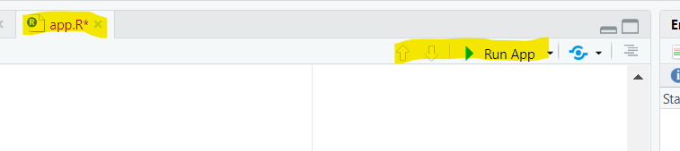
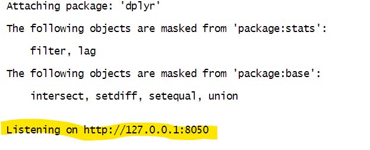

# LayYourHead: Vancouver's Shelter Guide

This dashboard provides is aimed at assisting non-profit organizations in Vancouver. It helps identify shelter locations for displaced individuals, providing a visual guide to support resource allocation and advocacy for more shelter facilities.

## Motivation
Target audience: Vancouver-based non-profit and Non-Governmental Organization(NGO).

Due to various socio-economic factors, Vancouver has seen an increase in the number of displaced individuals. These organizations work to ensure the safety and well-being of these individuals by providing shelter and essential resources. This dashboard helps organizations identify shelter locations, make informed decisions on resource distribution, and pinpoint areas in need of additional shelter services. It uses data sourced from the City of Vancouver [Open Data Portal](https://opendata.vancouver.ca/explore/dataset/homeless-shelter-locations/information/) to guide NGOs in their efforts to support displaced individuals.


## Link To Dataset
This dataset is sourced from the City of Vancouver’s [Open Data Portal](https://opendata.vancouver.ca/explore/dataset/homeless-shelter-locations/).

## Installation instructions

Installation from Docker
----
All installation steps for the Docker option assume you are running the commands in terminal  
- Ensure your Docker engine is running.
- Pull the specific Docker image for the app:
```
docker pull csuche/van-shelter-dahsboard:v1.0.2
```
- Run the image, ensuring it deletes once completed:
```
docker run --rm -p <YOUR PORT NUMBER>:3838 csuche/van-shelter-dahsboard:v1.0.2
```
- Open a browser and navigate to the following URL to interact with the dashboard:
```
http://localhost:<YOUR PORT NUMBER>
```
or
```
http://127.0.0.1:<YOUR PORT NUMBER>
```

Installation from the Github Repository
-----
- Open your terminal or preferred IDE.

- Clone the GitHub repository:
```
git clone https://github.com/cs-uche/LayYourHead.git
```
- Set up your environment using the `renv.lock` file; **running the code below in the R console**:
```
renv::restore()
```

- (Optional)**From your terminal** run the script to download and process the data
```Rscript scripts/shelter_data_pipeline.R --download --process```  
**To download only**  
```Rscript scripts/shelter_data_pipeline.R --download```  
**To process the data only**  
```Rscript scripts/shelter_data_pipeline.R` --process```

- Run the application
  - From RStudio IDE, open the `src` folder, then `app.R`, and click on the Run App button
  
  - Alternatively, run it from the terminal:  
  ```Rscript -e "shiny::runApp('src/app.R', port = <YOUR PORT NUMBER>, launch.browser = FALSE)"```
  - Or from the console:
  ```
  runApp('src')
  ```

**For options terminal and console above**
- The output should be similar to the image below in format `URL:PORT`


- Navigate to the URL in your browser, replacing <YOUR_PORT_NUMBER> with your specified port number, or click the link shown in the terminal:
```
http://localhost:<YOUR PORT NUMBER>
```
or
```
http://127.0.0.1:<YOUR PORT NUMBER>
```

## License
This project is licensed under the [MIT LICNENSE](./LICENSE.md)


